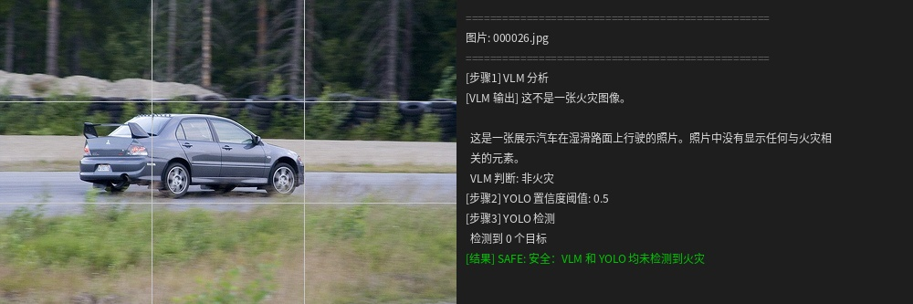
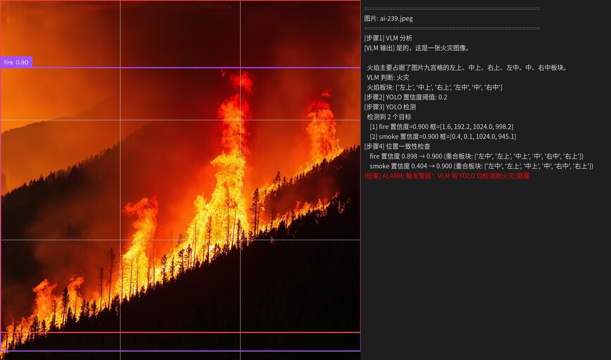
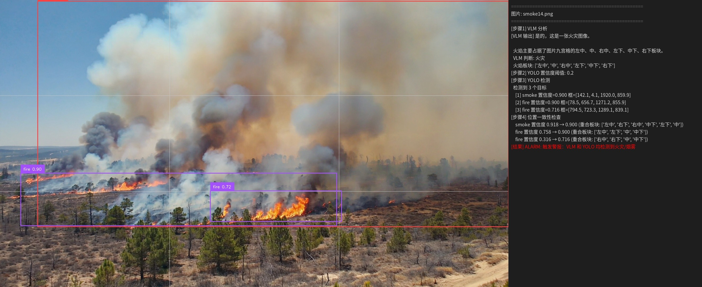

# 多模型协同火灾检测框架 🔥

**VLM（语义理解）+ YOLO（精确定位）串行协同** | 复杂场景召回率 **85.6% → 93.3%**

本框架面向**无人机巡检火灾图像**，解决了单一模型难以同时兼顾“语义理解”与“精确定位”的痛点。通过 **Qwen2.5-VL 先行语义判断 → 动态调整 YOLO 置信度阈值 → 位置一致性验证** 的串行协同策略，显著降低小目标漏检风险。

---

## 📊 核心指标

| 模型 | 核心指标 | 数值 |
|------|----------|------|
| YOLO11 + EMA（改进版） | mAP50 | **0.88** |
| YOLO11 + EMA | 推理速度 | >70 FPS |
| Qwen2.5-VL + LoRA（r=64） | 语义理解准确率 | **0.98** |
| **多模型协同框架** | 召回率（复杂场景） | **85.6% → 93.3%** |
| **多模型协同框架** | 虚警率 | **1.96%** |

> ✅ 论文级验证：100张复杂场景实例测试

---

## 🖼️ 效果展示

| 类型 |  协同框架（本方案） |
|------|-------------------|
| safe |  |
| attention | _vis.jpg) |
| fire |  |
| small fire |  |

📹 **1分钟演示视频**：[点击观看（B站）](https://www.bilibili.com/video/BV1KCEb6GEXm)（展示从命令行到输出结果的全过程）

---

## 🚀 快速开始（5分钟跑通推理）

### 1. 环境配置

```bash
# 克隆仓库
git clone https://github.com/sleepseagull/UAV-Fire-Collaboration.git
cd UAV-Fire-Collaboration

# 创建统一推理环境（Python 3.10）
conda create -n fire python=3.10
conda activate fire

# 安装 PyTorch（CUDA 11.8）
pip install torch==2.4.0 torchvision==0.19.0 torchaudio==2.4.0 --index-url https://download.pytorch.org/whl/cu118

# 安装项目依赖（YOLO + Qwen 统一依赖）
pip install ultralytics==8.3.185
pip install git+https://github.com/huggingface/transformers accelerate
pip install qwen-vl-utils peft supervision
```

### 2. 确认模型权重

训练好的权重位于对应目录：
| 模型 | 权重位置 |	文件 |
|------|-----------------|--------|
|YOLO11+EMA|./Collaboration/model/yolo11-fire/|best.pt / best.onnx|
|Qwen2.5-VL LoRA|./Collaboration/model/qwen2.5-vl-fire/	| adapter_config.json + adapter_model.safetensors|

📥 权重文件已上传，文件较大，需耐心等待

### 3. 运行协同推理

```bash
cd Collaboration

# 单张图片推理
python collaboration.py --image /path/to/test.jpg --save-vis

# 批量推理
python collaboration.py --image-dir ./images/ --save-vis --output-dir ./results/

# 禁用九宫格位置一致性检查（仅做双重验证）
python collaboration.py --image /path/to/test.jpg --no-grid-check
```

### 4. 输出预警等级

| 预警等级 | 含义 | VLM 判断 | YOLO 检测 |
|------|------|----------|---------|
| 🔴 ALARM | 触发警报 | 火灾 | 有火/烟 |
| 🟡 CAUTION | 注意防火 | 非火灾 | 有火/烟 |
| 🟠 ATTENTION | 需要人为关注 | 火灾 | 无火/烟|
| 🟢 SAFE | 安全 | 非火灾 | 无火/烟|

## 📁 项目结构

```text
UAV-Fire-Collaboration/
├── Collaboration/           # ⭐ 协同推理主入口
│   ├── collaboration.py     # 串行协同主脚本
│   ├── evaluate.py          # 验证评估脚本
│   ├── model/               # 训练好的权重
│   │   ├── yolo11-fire/
│   │   └── qwen2.5-vl-fire/
│   └── README.md            # 协同推理详细说明
│
├── yolo/                    # YOLO 目标检测模块
│   ├── yolov11/             # 基线训练代码
│   ├── yolov11-attention/   # 注意力机制集成代码（EMA/SCSA）
│   └── README.md            # YOLO 训练/验证/导出完整指南
│
├── qwen/                    # Qwen2.5-VL 语义理解模块
│   ├── Qwen2.5-VL 图片自动标注工具+结果/   # Step1: 自动标注
│   ├── 修改json文件代码+修改的各个结果/     # Step2: 数据后处理
│   ├── qwen2.5-vl/                        # Step3: LoRA微调训练
│   └── README.md                          # VLM 微调完整指南
│
└── .gitignore
```
💡 各模块的详细训练流程请查看对应文件夹内的 README.md

· YOLO 训练细节：数据准备、环境配置、EMA/SCSA 集成步骤 → yolo/README.md

· Qwen 微调细节：自动标注、后处理、LoRA 训练、验证评估 → qwen/README.md

· 协同推理细节：阈值动态调整逻辑、位置一致性算法、分级预警 → Collaboration/README.md

## 🔧 技术方案亮点
### 1. 动态阈值协同策略
VLM 判断为火灾 → YOLO 置信度阈值从 0.5 降至 0.2（避免漏检小火点）

VLM 判断无火灾 → 保持阈值 0.5（减少虚警）

### 2. 注意力机制选型对比
| 注意力 |	召回率 |	精确率	| 选型理由 |
|--------|---------|-----------|----------|
|EMA（选用）| 0.823	| 0.857	| 漏报容忍低 → 火灾场景优先 |
|SCSA| 0.789 | 0.897 | 更偏精确，ONNX 导出不兼容 |

### 3. 位置一致性检验
VLM 输出：九宫格板块（如“中上、中”）

YOLO 输出：边界框 → 映射到九宫格

重合板块 → 置信度 +0.1（最高 0.9），提供可解释的“双重确认”

## 📈 实验验证

| 模型 | Accuracy | Recall | F1-score | 耗时/张 |
|------|---------|--------|--------|-------|
| VLM 单独 | 0.880 | 0.878 | 0.929 | 7.24s |
| YOLO 单独 | 0.870 | 0.856 | 0.922 | 0.05s |
| 协同框架 | 0.930 | 0.933 | 0.960 | 7.27s |

>协同框架耗时瓶颈在 VLM，YOLO 额外开销可忽略

## 👤 作者
余赵婕 | 2026届毕业生 · 东北财经大学 · 大数据管理与应用

🏆 优秀毕业论文 | 2年计算机视觉项目经验

GitHub：github.com/sleepseagull

📹 **演示视频**：[点击观看（B站公开）](https://www.bilibili.com/video/BV1KCEb6GEXm)